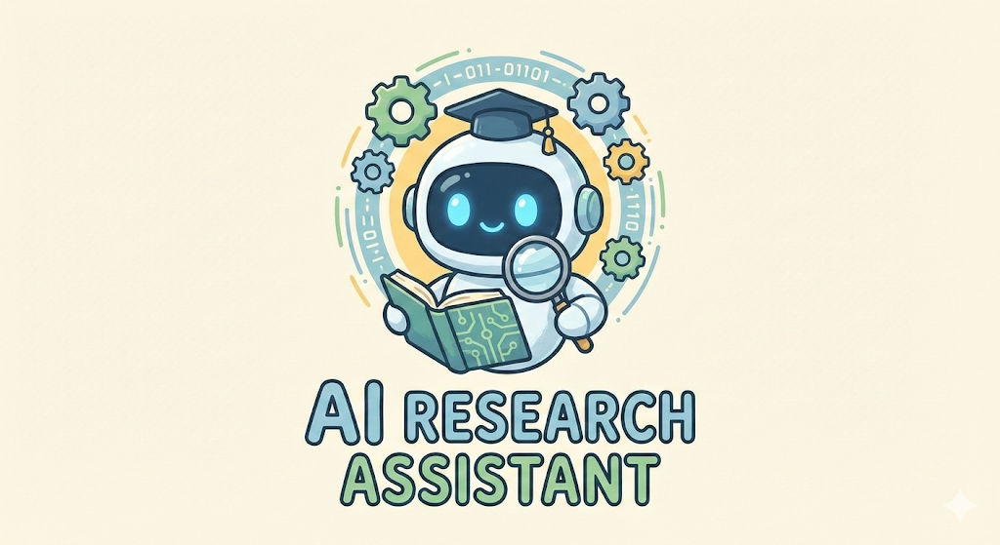
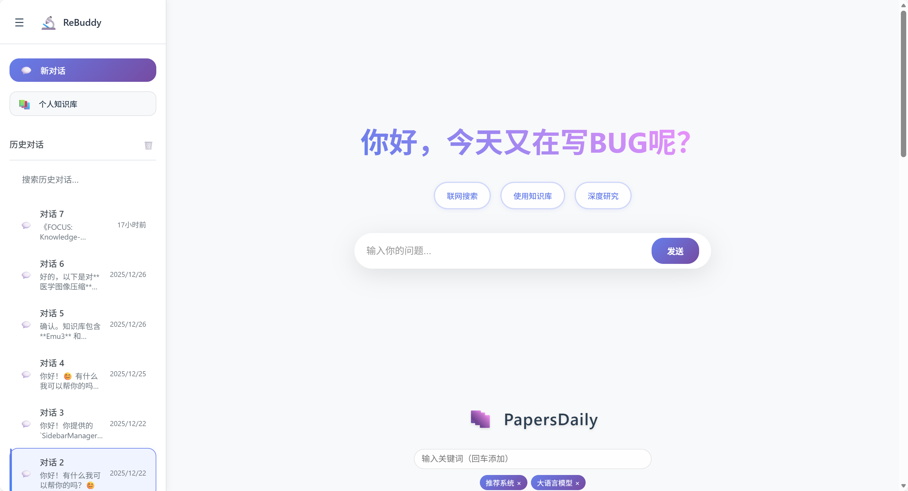
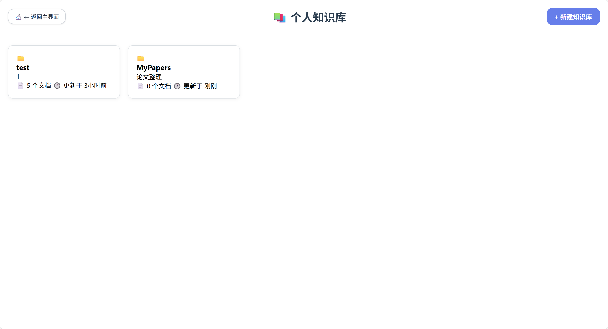
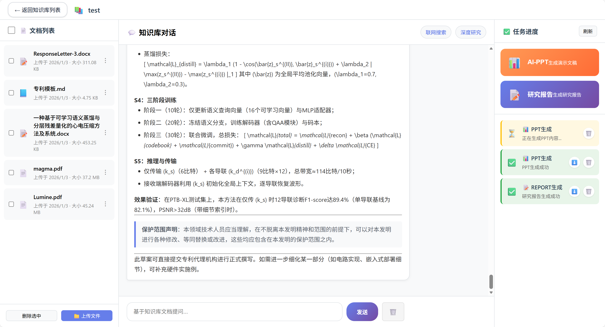
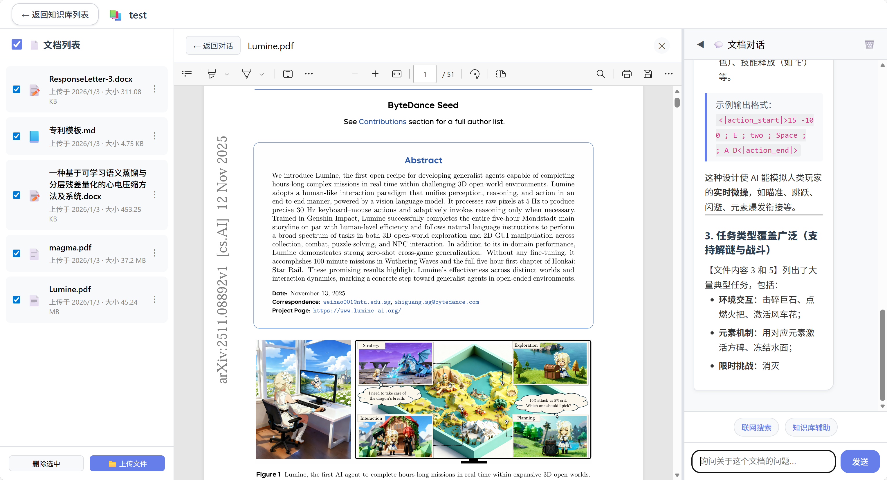
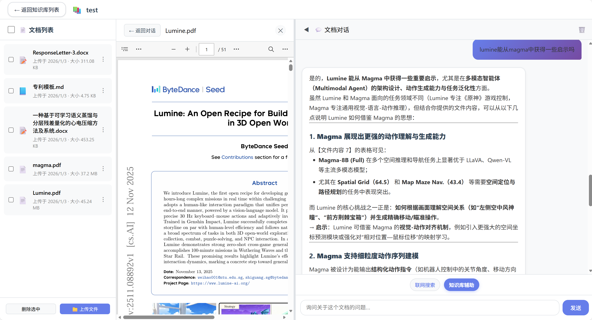

<div align="center">
  

  # ReBuddy · 你的阅读伴侣

  <p>
    <strong>不只是阅读，更是与知识的对话</strong>
  </p>

  <p>
    <a href="#-它是什么">它是什么</a> •
    <a href="#-你能做什么">你能做什么</a> •
    <a href="#-开始对话">开始对话</a> •
    <a href="#-技术细节">技术细节</a>
  </p>

  
  
</div>

---

## 📖 它是什么

ReBuddy 是你的**私人阅读伴侣**。

在这个信息爆炸的时代，我们每天都在与海量文字打交道——论文、报告、书籍、文章。ReBuddy 不是另一个冷冰冰的工具，而是一个**随时待命的阅读伙伴**：

- 帮你**消化**那些读不完的 PDF
- 陪你**探讨**那些想不通的问题
- 替你**连接**那些散落的知识
- 为你**记录**那些灵光一闪的时刻

> "我不再独自面对堆积如山的文档，而是有了可以对话的伙伴。" —— 一个研究者如是说

### 核心理念

**阅读即对话**

真正的阅读不是单向的接收，而是双向的交流。ReBuddy 让每一次阅读都变成一场深入的对话——你可以随时提问、质疑、联想、延伸。文字不再沉默，知识开始回应。

**知识即网络**

单一文档只是孤岛。ReBuddy 帮你将读过的内容编织成网，让不同来源的知识相互关联、彼此照亮。今天读到的概念，会自动连接到上周的笔记、去年的资料。

**积累即成长**

你的每一次阅读、每一次提问、每一次发现，都被温柔地保存下来。久而久之，ReBuddy 会成为你最了解你的知识伙伴，比你自己更清楚你关心什么、思考什么。

---

## 🌟 你能做什么

### 1. 与文档对话

上传任意 PDF，开始对话式阅读。

| 场景 | 你可以问 |
|------|---------|
| 快速把握 | "这篇的核心观点是什么？" |
| 深入理解 | "作者为什么用这个方法？" |
| 对比联系 | "这和上周读的那篇有什么关联？" |
| 批判思考 | "这个结论有什么潜在问题？" |
| 实践应用 | "如何在我的研究中应用这个框架？" |

**流式对话**：问题一经提出，答案如思绪般自然流淌，而非等待整篇回复。

### 2. 构建你的知识库

创建专题知识库，让相关文档相互对话。

```
📚 我的知识库
├── 🧠 认知科学          # 跨学科思考
├── 📊 数据可视化        # 设计原则与实践
├── 🌱 个人知识管理      # 如何更好地学习
└── 🔬 项目相关资料      # 工作文档集合
```

跨文档检索：向整个知识库提问，答案从多篇文献中综合而来。

### 3. 发现与探索

- **联网搜索**：当本地知识不够时，自动搜索网络获取最新信息
- **ArXiv 集成**：直接搜索和获取最新学术论文
- **深度研究**：让 Agent 帮你自动完成复杂的多步调研任务

### 4. 沉浸式阅读体验

- 📄 原文件对照阅读
- 🖼️ 提取的图片和表格
- 📝 AI 自动提取的元数据和摘要
- 🔗 知识间的自动关联建议

---

## 🚀 开始对话

### 第一步：准备环境

```bash
# 克隆项目
git clone <repository-url>
cd rebuddy

# 安装依赖（推荐使用清华源）
pip install -r requirements.txt -i https://pypi.tuna.tsinghua.edu.cn/simple
```

Python 版本要求：>= 3.9

### 第二步：配置

创建 `.env` 文件：

```ini
# 必需的：大模型 API
OPENAI_API_KEY="sk-..."
OPENAI_API_BASE="https://api.openai.com/v1"

# 可选的：增强搜索能力
SERPAPI_API_KEY="xxx"
TAVILY_API_KEY="xxx"
```

### 第三步：启动

```bash
python main_fastapi.py
```

浏览器打开 http://localhost:5000，开始你的第一场对话。

---

## 🎨 界面一览

### 主界面
简洁的首页，展示你的知识库和待阅读的文献


### 知识库管理
创建和管理你的专题知识库


### 知识库对话
与整个知识库对话，跨文档获取洞察


### 沉浸式阅读
边读边问，让阅读变成对话


### 跨文献关联
阅读时调取知识库中的其他文献进行辅助理解


---

## 🛠 技术细节

<details>
<summary>点击展开技术架构</summary>

### 系统架构

```
┌─────────────────────────────────────────────────────────────┐
│                        前端层 (Frontend)                      │
│              基于现代 Web 技术的响应式界面                      │
└────────────────────────┬────────────────────────────────────┘
                         │
                         ▼
┌─────────────────────────────────────────────────────────────┐
│                      API 层 (FastAPI)                        │
│              高性能异步 API，支持 SSE 流式响应                 │
└────────────────────────┬────────────────────────────────────┘
                         │
                         ▼
┌─────────────────────────────────────────────────────────────┐
│                    服务层 (Services)                          │
│  ┌──────────────┐  ┌──────────────┐  ┌──────────────┐      │
│  │ 对话服务     │  │ 知识库服务   │  │ 文件服务     │      │
│  └──────────────┘  └──────────────┘  └──────────────┘      │
└────────────────────────┬────────────────────────────────────┘
                         │
                         ▼
┌─────────────────────────────────────────────────────────────┐
│                    核心层 (Core)                              │
│  ┌──────────────┐  ┌──────────────┐  ┌──────────────┐      │
│  │ PDF 解析引擎 │  │ 向量数据库   │  │ LLM 客户端   │      │
│  │ 多引擎支持   │  │ Chroma/Qdrant│  │ 流式输出     │      │
│  └──────────────┘  └──────────────┘  └──────────────┘      │
└────────────────────────┬────────────────────────────────────┘
                         │
                         ▼
┌─────────────────────────────────────────────────────────────┐
│                    存储层 (Storage)                           │
│         用户隔离的文件系统 + 向量数据库 + 任务状态              │
└─────────────────────────────────────────────────────────────┘
```

### 核心技术栈

| 领域 | 技术 |
|------|------|
| 后端框架 | FastAPI + Uvicorn |
| 大模型 | OpenAI API / 兼容接口 |
| 文本向量化 | Sentence Transformers (all-MiniLM-L6-v2) |
| 向量数据库 | ChromaDB (本地) / Qdrant (生产) |
| PDF 解析 | PyMuPDF + Unstructured + PaddleOCR |
| 搜索增强 | Tavily / SerpAPI |
| Agent 框架 | SmolAgents |

### PDF 解析引擎

根据文档类型自动选择最佳解析策略：

- **PyMuPDF**: 基础文本、图片、表格提取
- **Unstructured**: 智能分段、结构化元素识别
- **pypdfplumber**: 快速文本和表格提取
- **PaddleOCR**: OCR 识别扫描文档
- **PP-Structure**: 高精度表格识别

### 数据流

```
用户上传 → 异步解析 → 文本提取 → 向量化存储 → 可随时对话
    ↓           ↓           ↓           ↓
  快速响应    进度跟踪    智能分段    语义索引
```

</details>

---

## 📂 项目结构

```text
rebuddy/
├── app/                     # 应用核心
│   ├── api/                 # API 路由
│   ├── core/                # 核心算法（解析、检索、对话）
│   ├── services/            # 业务服务
│   └── models/              # 数据模型
├── frontend/                # 前端界面
├── storage/                 # 用户数据（自动创建）
├── assets/                  # 截图和静态资源
├── main_fastapi.py          # 应用入口
└── requirements.txt         # 依赖
```

---

## 📝 使用建议

### 如何更好地使用 ReBuddy

1. **建立知识库的习惯**
   - 按主题而非时间组织文档
   - 定期回顾和整理知识库

2. **深度对话而非浅层查询**
   - 问 "为什么" 而不仅是 "是什么"
   - 要求对比、批判、联系

3. **持续积累**
   - 将日常阅读都纳入 ReBuddy
   - 让知识库成为你真正的"外脑"

4. **人机协作**
   - AI 负责检索和整合
   - 你负责判断和创造

---

## 🗺 路线图

### 已实现
- ✅ 多格式文档上传和解析
- ✅ 个人知识库管理
- ✅ 流式对话系统
- ✅ 联网搜索增强
- ✅ 多用户数据隔离
- ✅ ArXiv 集成

### 计划中
- 🚧 阅读笔记和批注
- 🚧 知识图谱可视化
- 🚧 阅读进度追踪
- 🚧 智能推荐阅读
- 🚧 移动端适配
- 🚧 团队协作空间

---

## 🤝 参与贡献

ReBuddy 是一个开放的项目。如果你有任何想法、建议或发现了问题，欢迎：

- 提交 Issue
- 发起 Pull Request
- 分享你的使用体验

---

## 📄 许可证

GNU General Public License v3.0 (GPL-3.0)

---

<div align="center">

**让每一次阅读，都变成一场对话。**

</div>
